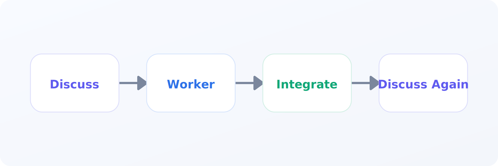
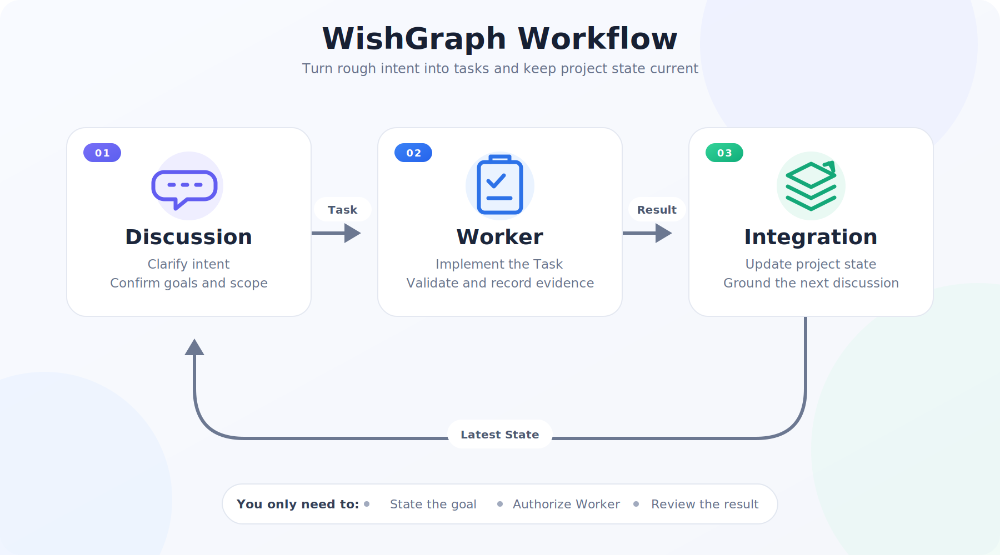

# WishGraph

[English](README.md) | [简体中文](README.zh-CN.md)

[](https://github.com/odopk-spring/wishgraph/actions/workflows/ci.yml)


**File-backed project governance for AI coding agents.** WishGraph turns intent into auditable specs, tasks, execution evidence, and shared project state so a project can continue across agents and conversations without depending on chat memory.



WishGraph is an installable Codex/Claude Code skill, a set of project templates, and an optional hook runtime. The human sets direction and reviews decisions; agents translate that intent into bounded work and write the resulting facts back to durable files.

[Get started](#60-second-setup) · [See the workflow](#how-it-works) · [Browse the docs](docs/README.md) · [Read the method](docs/wishgraph-method.en.md)

## Why WishGraph

Complex AI-assisted projects often fail between coding sessions: scope drifts, earlier decisions disappear, agents guess file locations, and completed work never updates the shared project picture.

WishGraph keeps five things explicit:

- **Intent:** what the project should accomplish and what is out of scope.
- **Structure:** which modules, contracts, and files own each responsibility.
- **Work:** one visible Task Spec for each formal execution unit.
- **Evidence:** validation results and immutable Run Reports.
- **Current state:** a compact snapshot for the next discussion or agent.

## 60-second setup

### Codex

Ask Codex to install the skill:

```text
Use $skill-installer to install https://github.com/odopk-spring/wishgraph/tree/main/skills/wishgraph
```

Or install the skill and safe, non-blocking project hooks together:

```bash
curl -fsSL https://raw.githubusercontent.com/odopk-spring/wishgraph/main/scripts/install-wishgraph.sh | bash -s -- codex --setup-project
```

### Claude Code

```bash
curl -fsSL https://raw.githubusercontent.com/odopk-spring/wishgraph/main/scripts/install-wishgraph.sh | bash -s -- claude-user --setup-project
```

### Windows PowerShell

```powershell
& ([scriptblock]::Create((irm 'https://raw.githubusercontent.com/odopk-spring/wishgraph/main/scripts/install-wishgraph.ps1'))) codex -SetupProject
```

Safe setup starts in `warn` mode and does not block commits. After one successful closeout, enable strict checks with `--strict` on Bash or `-Strict` on PowerShell. See [Getting Started](GETTING_STARTED.md) for the guided flow and other installation targets.

Once installed, start with natural language:

```text
Start discussion.
Set up WishGraph for this project in safe mode.
Execute task 012.
Refresh project status.
```

## How it works



1. **Discussion** clarifies intent, boundaries, and success criteria, then writes an approved Task Spec.
2. **Execution** claims that Task, makes the smallest scoped change, validates it, and writes an immutable Run Report.
3. **Integration** absorbs eligible results and refreshes shared project state before the next discussion.

The normal user experience is a Discussion window plus explicit, user-visible Execution windows. Integration is a temporary control transaction: it can run in the background only when the host genuinely supports that capability; otherwise the active agent performs it in an isolated phase or leaves it pending. Hooks expose and enforce state, but they do not secretly start agents, merge code, or invent project meaning.

## The project state graph

| File | What it keeps |
| --- | --- |
| `PRD.md` | Goals, scope, roadmap, and current product decisions |
| `ARCHITECTURE.md` | System boundaries, dependencies, and ownership |
| `CODEMAP.md` | Features and contracts mapped to source files |
| `CONVENTIONS.md` | Collaboration, validation, and Git rules |
| `tasks/build/*.md` | Self-contained, versioned execution specs |
| `reports/runs/*.md` | Immutable evidence from each execution unit |
| `reports/PROJECT_STATUS.md` | The latest integrated project snapshot |
| `prompts/*.md` | Stable handoffs for Discussion, Execution, and Integration |

Human-readable meaning stays in Markdown. Small versioned JSON blocks carry only workflow facts such as Task state, authorization, validation, and integration status.

## Safety boundaries

- No Worker starts without explicit human authorization.
- The default execution mode allows one active Worker Claim per Task attempt.
- Claims are atomic across local worktrees sharing one Git common directory; they are not a distributed lock across machines.
- High-risk, conflicting, parallel, or ambiguous results return to Discussion for a decision.
- Run Reports are immutable, and integration has a single writer for shared project state.
- Human review remains the authority for direction and judgment.

## Choose your path

| Goal | Start here |
| --- | --- |
| Try WishGraph in a project | [Getting Started](GETTING_STARTED.md) |
| Understand the method | [WishGraph Method](docs/wishgraph-method.en.md) |
| Inspect the hook protocol | [External-Memory Hooks](docs/memory-sync-hooks.md) |
| Adapt it to Claude Code | [Claude Code adapter](adapters/claude-code/README.md) |
| Adapt it to another agent | [Generic adapter](adapters/generic/README.md) |
| Browse templates manually | [Templates](templates/README.md) |

## Repository map

```text
skills/wishgraph/   Installable skill and bundled runtime
templates/          English and Chinese project-memory templates
adapters/           Claude Code and generic agent instructions
docs/               Method, protocol, and workflow documentation
scripts/            Bash and PowerShell installers
tests/              Runtime and installer regression tests
```

## Language support

WishGraph supports English, Simplified Chinese, and bilingual project memory. English is the default repository entry; [README.zh-CN.md](README.zh-CN.md), [`templates/zh-CN`](templates/zh-CN), Chinese adapters, and Chinese documentation provide the parallel Chinese path. Commands, paths, code identifiers, and structured state remain language-neutral.

## Status and known limits

WishGraph is a **v0.1 public beta**. The skill validates, fresh installation is tested, and the runtime has automated lifecycle coverage. It still benefits from real-project feedback, broader host testing, and usability refinement around the Discussion / Execution / Integration model.

WishGraph is a project-governance layer, not an autonomous software factory. It does not replace product decisions, code review, CI, or distributed coordination.

## License

WishGraph is released under the [PolyForm Noncommercial License 1.0.0](LICENSE). You may download, study, modify, and redistribute it for noncommercial purposes. Commercial use requires separate written permission. This is a source-available noncommercial license, not an OSI open-source license.
