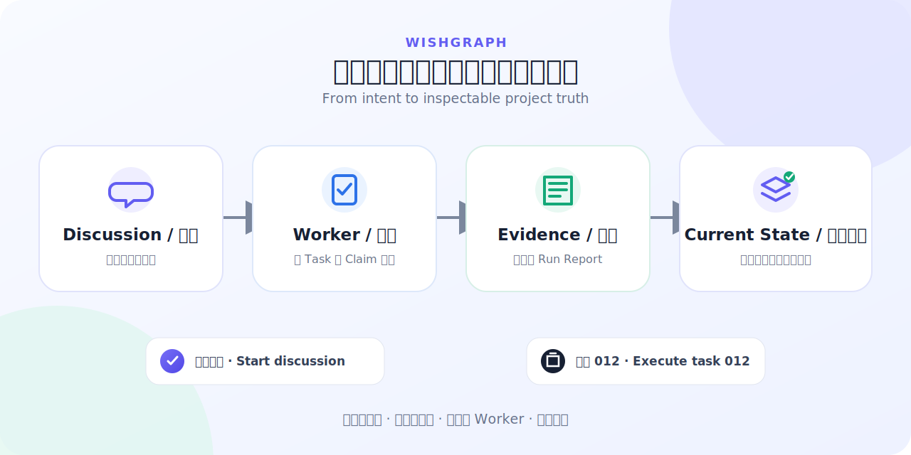

<p align="center">
  
</p>

<h1 align="center">WishGraph</h1>

<p align="center"><strong>Bounded AI execution with durable project memory.</strong></p>

<p align="center">An opt-in coordination layer for Codex and Claude Code that separates planning, execution, evidence, and integration without filling the repository with process files.</p>

<p align="center">
  <a href="#install-in-60-seconds"><strong>Install in 60 seconds</strong></a> ·
  <a href="#one-minute-tour"><strong>See one complete run</strong></a> ·
  <a href="#faq">FAQ</a> ·
  <a href="#safety-boundaries">Safety</a>
</p>

<p align="center">
  <a href="https://github.com/odopk-spring/wishgraph/actions/workflows/ci.yml"></a>
  
  
</p>

<p align="center"><strong>English</strong> · <a href="README.zh-CN.md">简体中文</a></p>

<picture>
  <source media="(prefers-color-scheme: dark)" srcset="docs/assets/hero/wishgraph-hero-dark.svg">
  <source media="(prefers-color-scheme: light)" srcset="docs/assets/hero/wishgraph-hero-light.svg">
  
</picture>

WishGraph turns an open-ended request into a bounded Task, routes explicitly authorized work to an inspectable Worker, and closes the loop with validation evidence and a rewritten current-state snapshot.

```text
Wish → Spec → Task → Worker → Validation → Run Report → Integration → Current State
```

Stable product and engineering facts stay in existing project documents when possible. WishGraph adds only the missing Task, current-status, and execution-evidence files needed for reliable handoff, so a new window or host can continue without replaying chat history.

## The framework

WishGraph is not about making every agent read more documentation. Each phase reads only what it needs.

| Part | Responsibility |
| --- | --- |
| **Project memory** | Keeps product rules, architecture, code locations, and current state without storing whole chat transcripts. |
| **Discussion** | Clarifies intent, sets boundaries, and writes Tasks. It does not implement business code. |
| **Worker** | Executes one authorized Task with validation evidence. Discussion routes an independent thread; a neutral window can bind itself directly. |
| **Integration** | Evaluates the result inside Discussion and updates shared state. It proceeds automatically when safe and asks only for a material decision. |

The default read scope stays small:

- Discussion starts with `reports/PROJECT_STATUS.md`, pending notifications, and only the active runtime facts needed for the next action.
- A Worker reads its exact Task or Revision, execution rules, necessary status, and source files inside scope.
- Integration reads this run's reports and only the shared files they actually affect.

Historical reports remain available without accumulating in the current-state file or being reread at every start.

> WishGraph is opt-in per project. A global Skill installation means “available,” not “active in every folder.”

## One-minute tour

Suppose you want to add dark mode to a reading screen.

### 1. Start the discussion

In a project where WishGraph is already enabled, say:

```text
Start discussion
```

Then speak normally: “I want dark mode on the reading screen.” Discussion uses current project state to ask only the questions that change the outcome—reading screen or whole app, system-controlled or manual, and what proves the feature works.

Once the boundary is clear, it creates a self-contained Task such as `012b`, including scope, non-goals, allowed files, and validation.

### 2. Authorize execution

Say:

```text
Execute task 012b
```

WishGraph lets the current host choose the best inspectable Worker it can genuinely provide:

- If the host supports a native Agent thread or background session, it creates an independent Worker and saves the real thread/session ID.
- If native creation is unavailable or fails, Discussion prints a compact cross-host handoff: the project directory, copy-ready Codex and Claude Code startup commands with their profiles, and the final `执行 012b` line.

The Worker changes code only after exact Task preflight and Claim acquisition. It does not read unrelated Tasks, all historical reports, or the complete source tree.

The “under three seconds” dispatch target covers exact-command parsing, durable canonical-Run authorization, and a copy-ready host route. Native thread/session creation and model startup may take longer; until a real ID and Claim exist, the Worker remains `starting` / `awaiting_claim`, never falsely `running`.

### 3. Validate and update the project

The Worker writes an immutable Run Report describing the patch, checks, and remaining risk. On its next activation, Discussion receives a completion reminder and enters local Integration:

- Complete evidence and no conflict: integrate and refresh current project state automatically.
- Missing report or failed validation: mark the work blocked instead of pretending it is done.
- Public API, product, or conflict decision: ask only that concrete question.

When you later switch windows, models, or even between Codex and Claude Code, there is no full prompt to copy. Open the same Git project and say `Start discussion`; the new agent resumes from project files.

### 4. Keep small changes small

Feedback such as “I dislike this blue; make it warm gray” becomes a lightweight Revision of the original Task, not another long spec. It becomes a formal follow-up Task only when it reaches a public API, schema, persistence, dependency, security boundary, or new product decision.

## Install in 60 seconds

WishGraph requires Git and Python 3.9+ and installs no Python packages. These commands install the Skill and enable safe-mode Hooks in the **current Git project**. Project setup installs both Codex and Claude Code adapters by default; that is the recommended default, not a requirement to use both.

### Codex · macOS / Linux

Run inside the target project:

```bash
curl -fsSL https://raw.githubusercontent.com/odopk-spring/wishgraph/main/scripts/install-wishgraph.sh | bash -s -- codex --setup-project
```

### Claude Code CLI · macOS / Linux

Run inside the target project:

```bash
curl -fsSL https://raw.githubusercontent.com/odopk-spring/wishgraph/main/scripts/install-wishgraph.sh | bash -s -- claude-user --setup-project
```

### Windows PowerShell

Codex:

```powershell
& ([scriptblock]::Create((irm 'https://raw.githubusercontent.com/odopk-spring/wishgraph/main/scripts/install-wishgraph.ps1'))) codex -SetupProject
```

Claude Code:

```powershell
& ([scriptblock]::Create((irm 'https://raw.githubusercontent.com/odopk-spring/wishgraph/main/scripts/install-wishgraph.ps1'))) claude-user -SetupProject
```

After installation:

```text
1. Reopen the current Agent session
2. Say: Start discussion
```

To protect only one host, add `--project-hosts codex` or `--project-hosts claude` (PowerShell: `-ProjectHosts codex|claude`). The choice is saved as `required_hosts`; an unselected host is not treated as an install error and is not protected.

The default `warn` mode is a quiet advisory mode: ordinary documentation and closeout gaps do not block and stay silent during normal work. Authority and state-integrity boundaries still fail closed. After one successful full run, enable strict gates with `--strict` on Bash or `-Strict` on PowerShell if you want them.

For an Agent-guided setup, install this repository's `skills/wishgraph` with `$skill-installer` in Codex, or invoke `/wishgraph` after installing it in Claude Code, then say:

```text
Use WishGraph for this project.
```

See [Getting Started](GETTING_STARTED.md) for existing-project adoption, other install modes, and recovery.

`warn` and `enforce` apply only when the current host has installed and loaded its WishGraph Adapter. They are not an operating-system sandbox. Reopen each selected Agent before its first managed Task so WishGraph can confirm a current-session Hook receipt.

The user-level installer merges a global Adapter that stays silent outside explicitly enabled projects. Claude background launch injects its Worktree settings per launch, so an enabled project does not need a duplicate `.claude/settings.json`; existing user settings are not overwritten.

## Host support

You do not choose between a new window, background session, or subagent. WishGraph checks what the current host can genuinely provide and selects the best Worker container; when native creation is unavailable, it falls back strictly to one manual execution command.

| Host | Preferred Worker | Native creation unavailable | Boundaries that do not change |
| --- | --- | --- | --- |
| **Codex** | A user-visible, inspectable, controllable Agent thread when the current surface supports it. | Show the project directory, Codex/Claude startup commands, and Task phrase. | Exact authorization, Claim, scope, validation, Run Report, and Integration. |
| **Claude Code CLI** | A managed `claude --bg --agent wishgraph-worker` background session in a unique Worktree after capability and Agent checks pass. | Show the same cross-host handoff. | Same boundaries; `/tasks` views background work and does not create a WishGraph Task. |
| **Other hosts** | A genuinely inspectable independent thread or window. | Use the generic cross-host handoff and Task phrase. | Missing host capabilities never expand Discussion authority. |

Python 3.9+ is a WishGraph runtime requirement; your business project does not need to be written in Python.

## FAQ

### Does installing the Skill activate WishGraph in every project?

No. The Skill may be global, but every project must opt in explicitly. In an inactive project, `Start discussion` is ordinary text and does not create files or enter the workflow.

### Do I need to copy a migration prompt when I change windows or agents?

No. WishGraph handoff state lives in project files and the Git-common runtime, not in the previous conversation. Open the same project and say `Start discussion`. When switching hosts, first confirm it is selected in `required_hosts`; otherwise explicitly enable it, install its Adapter, and reopen the session. Copying a full prompt is not the normal handoff and is not a Claude Code migration requirement.

### What do the three common commands mean?

- `Start discussion` moves the current neutral window into Discussion and loads the compact Project Status snapshot.
- `Execute task 012` routes an independent Worker from Discussion. In an ordinary neutral window it binds that current window as the Worker instead of creating a second one. Both paths match `012` exactly and never collide with `012b` or `012ba`.
- `Refresh project status` refreshes active state and relevant terminal evidence without scanning the whole source tree or report history by default.

### Is the Codex experience identical to Claude Code?

Commands, Tasks, Claims, validation, and project state are the same; the Worker container depends on host capabilities. See [Host support](#host-support) above. A native launch failure never allows Discussion to take over business-code edits.

### Does a completed background Worker pop up the Discussion window?

No. WishGraph runs no daemon, terminal polling loop, or cross-window IPC service. A normal Worker closeout writes a pending notification; Discussion consumes it on the next SessionStart, prompt, or explicit refresh.

### Will WishGraph fill my repository with process files?

Existing repositories use native-lite adoption by default: verify only the paths, symbols, commands, and conflicts needed by the current Task, reuse suitable native sources, and add only the missing Project Status. WishGraph creates no project-level prompts, document registry, trust state, or blank Run Report. Task, Revision, and report directories appear only when first needed; immutable history stays in actual Run Reports while `PROJECT_STATUS.md` remains the only user-readable dynamic snapshot.

### Does every small correction need a full Task?

No. A clear, low-risk correction linked to the original Task uses a lightweight Revision. Public API, schema, persistence, dependency, permission, security, privacy, or new product decisions return to Discussion as a formal Task.

### Can I switch between Codex and Claude Code?

Yes. PRDs, Tasks, reports, and project state are portable inside the Git project. Host thread/session IDs are not shared across platforms, so the new agent establishes its own valid Worker binding and Claim before execution.

### Is WishGraph a sandbox?

No. Hooks can gate writes, builds, commits, and lifecycle events exposed by the host, but they do not replace operating-system permissions or container isolation. Complete read interception also depends on host capabilities.

## Safety boundaries

- **Explicit authority:** a Formal Worker must be bound to one exact Task or Revision; vague conversation does not grant execution authority.
- **Role separation:** Discussion handles planning, Tasks, Integration, and presentation. It does not implement business code or run Worker validation.
- **Bound Claims:** business writes and builds require a Claim bound to Task, session, branch, absolute worktree, scope, and validation plan.
- **Inspectable Workers:** only an Agent with a stable thread/session ID, independent context, and inspect/stop/steer controls can become a Formal Worker. Hidden subagents remain Helpers.
- **Single-writer project state:** Workers propose shared updates in Run Reports; only Discussion-local Integration with a bound lease updates shared project truth.
- **Evidence-based completion:** a natural-language “done” message is insufficient. Task state, Run Report, validation, and Claim closeout must agree.
- **Local coordination boundary:** Claims coordinate worktrees sharing one local Git common directory; they are not distributed locks across machines.

WishGraph is a **v0.1 public beta**. CI exercises the complete test suite on Ubuntu and macOS with Python 3.9 and 3.13, and runs the complete suite plus the PowerShell installer path on Windows with Python 3.13. A bundled cold-process benchmark checks Hook latency and source-tree scaling separately. Broader real-project and host-version testing is still required before a stable v1.

## Where project memory lives

| File | Human meaning |
| --- | --- |
| `PRD.md` | Goals: what the project is doing, why, and what is out of scope. |
| `ARCHITECTURE.md` | Structure: modules, dependencies, data flow, and boundaries. |
| `CODEMAP.md` | Address book: where features, state, storage, and tests live. |
| `CONVENTIONS.md` | Project-native build, test, coding, permission, and Git rules. |
| `tasks/*.md` | Formal Tasks with scope, non-goals, validation, and rollback boundaries. |
| `tasks/revisions/*.md` | Lightweight, low-risk corrections. |
| `reports/runs/*.md` | Immutable Worker execution and validation evidence. |
| `reports/PROJECT_STATUS.md` | Current dashboard: latest result, risk, active work, and next action. |

Existing projects do not need to create every file mechanically. WishGraph reuses native documents that already own the same truth.

WishGraph creates only these named documents and directories. It does not police the rest of the repository root: user-owned files such as `AGENTS.md`, `CLAUDE.md`, framework configuration, and native project folders remain untouched. Project-level prompts and a blank Run Report template are not copied into user projects.

## Go deeper

Source-of-truth order: runtime behavior is defined by the Skill assets and automated tests; user experience by this README and Getting Started; detailed rules by `skills/wishgraph/references/`. Files under `docs/` are synchronized GitHub-facing explanations, not a second behavior specification.

| What you need | Document |
| --- | --- |
| Installation through the first complete run | [Getting Started](GETTING_STARTED.md) |
| Method and project-compression idea | [WishGraph Method](docs/wishgraph-method.en.md) |
| Roles, states, and command parsing | [Orchestration state machine](docs/orchestration-state-machine.md) |
| Hooks, gates, performance, and host limits | [External-Memory Hooks](docs/memory-sync-hooks.md) |
| Current Claude Code CLI adaptation | [Claude Code adapter](adapters/claude-code/README.md) |
| Hosts without native Skills | [Generic Agent adapter](adapters/generic/README.md) |
| Repository templates | [Templates](templates/README.md) |

```text
skills/wishgraph/   Installable Skill and bundled runtime
templates/          Human-readable English and Chinese templates
adapters/           Claude Code and generic Agent guidance
docs/               Method, state machine, and Hook references
scripts/            Bash and PowerShell installers
tests/              Installer and runtime regression tests
```

## Community and contact

- Bugs and concrete feature requests: [GitHub Issues](https://github.com/odopk-spring/wishgraph/issues)
- Commercial licensing and partnerships: [zuelfma@foxmail.com](mailto:zuelfma@foxmail.com)
- Chinese articles, practical notes, and project updates: WeChat Official Account **有言以对Spring**


The repository remains the source of truth for releases, installation instructions, compatibility, and project status.

## License

WishGraph uses the [PolyForm Noncommercial License 1.0.0](LICENSE). You may download, study, modify, and redistribute it for noncommercial purposes. Commercial use requires separate written permission. It is a source-available noncommercial license, not an OSI open-source license.
