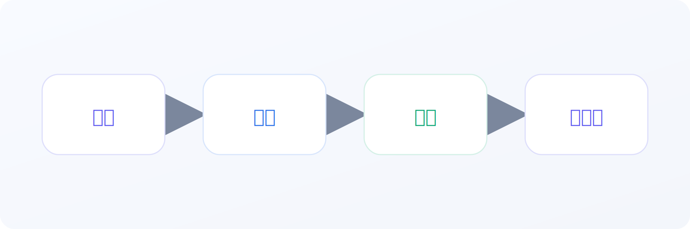
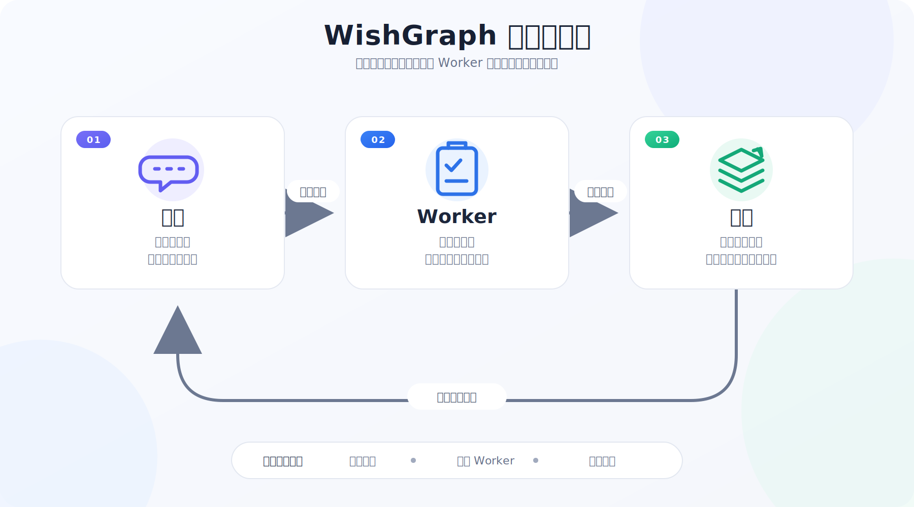

# WishGraph

[English](README.md) | [简体中文](README.zh-CN.md)

[](https://github.com/odopk-spring/wishgraph/actions/workflows/ci.yml)


**为 AI 编程 Agent 提供文件化项目治理。** WishGraph 把用户意图转换成可审计的规格、任务、执行证据和共享项目状态，让项目跨越不同 Agent 与对话持续推进，而不是依赖聊天窗口记忆。



WishGraph 同时提供可安装的 Codex / Claude Code Skill、项目模板和可选 Hooks。用户负责方向与判断；Agent 把意图翻译成有边界的工作，并将执行后的项目事实写回持久文件。

[立即上手](#60-秒配置) · [查看工作流程](#工作原理) · [浏览文档](docs/README.md) · [阅读方法论](docs/wishgraph-method.md)

## 为什么需要 WishGraph

复杂 AI 协作项目的问题经常发生在两次编码之间：范围逐渐漂移，早期决定消失，Agent 猜测文件位置，已经完成的修改也没有更新共享项目状态。

WishGraph 将五类事实显式保存：

- **意图：** 项目要完成什么，哪些内容不在范围内。
- **结构：** 模块、契约与文件分别负责什么。
- **任务：** 每个正式执行单元都有一个可见 Task Spec。
- **证据：** 验证结果与不可变 Run Report。
- **当前状态：** 下一次讨论或下一个 Agent 可直接读取的压缩快照。

## 60 秒配置

### Codex

让 Codex 安装 Skill：

```text
Use $skill-installer to install https://github.com/odopk-spring/wishgraph/tree/main/skills/wishgraph
```

也可以一次安装 Skill 和安全、非阻塞的项目 Hooks：

```bash
curl -fsSL https://raw.githubusercontent.com/odopk-spring/wishgraph/main/scripts/install-wishgraph.sh | bash -s -- codex --setup-project
```

### Claude Code

```bash
curl -fsSL https://raw.githubusercontent.com/odopk-spring/wishgraph/main/scripts/install-wishgraph.sh | bash -s -- claude-user --setup-project
```

### Windows PowerShell

```powershell
& ([scriptblock]::Create((irm 'https://raw.githubusercontent.com/odopk-spring/wishgraph/main/scripts/install-wishgraph.ps1'))) codex -SetupProject
```

安全配置默认使用 `warn`，不会阻止提交。正确完成一次任务收尾后，可在 Bash 使用 `--strict`，或在 PowerShell 使用 `-Strict` 开启严格检查。完整引导和其他安装目标见 [Getting Started](GETTING_STARTED.md)。

安装后直接使用自然语言：

```text
开始讨论。
为当前项目安全配置 WishGraph。
执行 012 号任务。
刷新项目状态。
```

## 工作原理



1. **讨论**澄清意图、边界和成功标准，并写出已批准的 Task Spec。
2. **执行**认领该任务，完成最小范围修改，运行验证并写入不可变 Run Report。
3. **集成**吸收符合条件的结果，刷新共享项目状态，再进入下一轮讨论。

用户通常只会看到 Discussion 窗口和显式创建的 Execution 窗口。Integration 是一次临时控制事务：宿主确实支持后台能力时才会后台运行；否则由当前 Agent 进入隔离阶段执行，或保留为 pending。Hooks 只负责暴露和约束状态，不会暗中启动 Agent、合并代码或编造项目含义。

## 项目状态图谱

| 文件 | 保存的内容 |
| --- | --- |
| `PRD.md` | 目标、范围、路线图与当前产品决定 |
| `ARCHITECTURE.md` | 系统边界、依赖关系与职责归属 |
| `CODEMAP.md` | 功能和契约到源文件的映射 |
| `CONVENTIONS.md` | 协作、验证与 Git 规则 |
| `tasks/build/*.md` | 自包含、带版本状态的执行规格 |
| `reports/runs/*.md` | 每个执行单元的不可变证据 |
| `reports/PROJECT_STATUS.md` | 最新的集成后项目快照 |
| `prompts/*.md` | Discussion、Execution 与 Integration 的稳定交接入口 |

项目语义保留在便于人阅读的 Markdown 中。小型、带版本的 JSON 块只记录 Task 状态、授权、验证和集成状态等机械事实。

## 安全边界

- 没有人类显式授权就不会启动 Worker。
- 默认执行模式下，同一 Task attempt 只能有一个 active Worker Claim。
- Claim 在共享同一本地 Git common directory 的 worktree 间原子生效，但不是跨机器分布式锁。
- 高风险、冲突、并行或含糊的结果会返回 Discussion 请求决定。
- Run Report 不可变，集成共享项目状态时只有一个写入者。
- 项目方向和最终判断始终由人负责。

## 按目标选择入口

| 目标 | 从这里开始 |
| --- | --- |
| 在项目里试用 WishGraph | [Getting Started](GETTING_STARTED.md) |
| 理解方法论 | [WishGraph 方法论](docs/wishgraph-method.md) |
| 查看 Hooks 协议 | [外置记忆 Hooks](docs/memory-sync-hooks.zh-CN.md) |
| 适配 Claude Code | [Claude Code 中文适配器](adapters/claude-code/README.zh-CN.md) |
| 适配其他 Agent | [通用中文适配器](adapters/generic/README.zh-CN.md) |
| 手动浏览模板 | [Templates](templates/README.md) |

## 仓库结构

```text
skills/wishgraph/   可安装 Skill 与内置运行时
templates/          英文和中文项目记忆模板
adapters/           Claude Code 与通用 Agent 适配说明
docs/               方法论、协议与工作流文档
scripts/            Bash 和 PowerShell 安装器
tests/              运行时与安装器回归测试
```

## 语言支持

WishGraph 支持英文、简体中文和双语项目记忆。GitHub 默认入口为英文；当前中文首页、[`templates/zh-CN`](templates/zh-CN)、中文适配器和中文文档构成平行的中文入口。命令、路径、代码标识符和结构化状态保持语言无关。

## 当前状态与限制

WishGraph 当前是 **v0.1 public beta**。Skill 校验、全新安装与运行时生命周期已经有自动化覆盖，但仍需要更多真实项目反馈、更广泛的宿主验证，以及对 Discussion / Execution / Integration 使用体验的继续打磨。

WishGraph 是项目治理层，不是自动软件工厂。它不能替代产品决定、代码审查、CI 或分布式协调。

## 许可证

WishGraph 使用 [PolyForm Noncommercial License 1.0.0](LICENSE)。你可以为非商业目的下载、学习、修改与再分发；商业使用需要获得著作权人的单独书面许可。它是 source-available 非商业许可证，不是 OSI 开源许可证。
